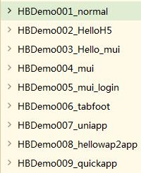

# MakiLearn
20180613 20:00pm~23:00pm  HBuilder IDE官方demo粗略学习

20180614 20:00pm~22:40pm  HBuilder官方文档，app优化，查看一些页面跳转、启动白屏、上拉下拉的坑。
20180615 20:00pm~23:10pm  Html5+ 视频教程 的窗口open create的爬坑之旅

20180616 整理网盘视频资料，UE4的初级FPS教程5节课
20180617 UE4暂时放一边，先速学html5的canvas的教程，背景滚动，玩家操作，发射子弹
20180618 敌人飞机绘制，爆炸效果，bug为不能第一次碰撞时消除
20180619 22:00~23:30 解决爆炸效果移除错位的bug，完成爆炸效果动画，游戏音效
20180621 23:00~23:40 稍微看了部分canvas手势操作
20180625 22:00~23:30 手势操作飞机实现
20180627 22:00~23:00 阅读敏捷开发第二章节 团队合作时的态度，提起勇气询问和沟通寻找解决方法，不要直接否定他人的观点，解决问题优于指责犯错者，对于陈旧的代码块的修改，提出时间规划来理解和重构。
20180628 21:00~22:00 阅读敏捷开发第三章节 了解前沿技术专业流行名词，团队分享近期成果和效率的午餐会议，放弃老旧的代码用更快捷的框架，多问为什么追溯源头原因，开发节奏的控制小模块完成的激励。
20180701 15:00~16:30 阅读敏捷开发第四章节 客户做决定，决定使用新框架带来的优劣影响，保证提交到svn的项目是可直接运行的，多人合作开发的迭代项目时多次集成演示给客户得到反馈，敌人是变化，早反馈早修改。

